# Crock-on Recipe Bog

## Introduction

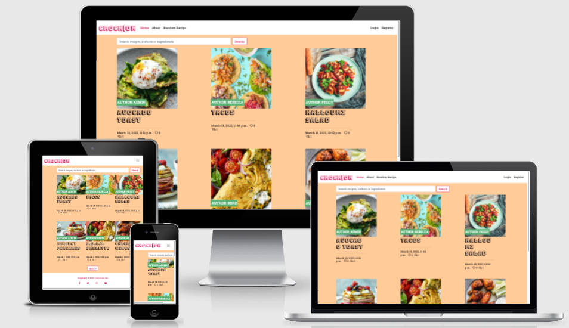

Crock-on is a recipe sharing blog website. It aims to provide users with easy recipe ideas that their fellow amateur cooks have shared. It aims to be accessible to every level of cook, and also to serve as a place where people can share their own recipes and interact with other cook's recipes without having to go through the motions of setting up their own cookery blog. 

# Table of Contents 

- [Crock-on Recipe Bog](#crock-on-recipe-bog)
  * [Introduction](#introduction)
- [User Experience (UX)](#user-experience--ux-)
  * [Strategy](#strategy)
    + [Project Goals](#project-goals)
    + [User Goals](#user-goals)
    + [Site Owner's Goals](#site-owner-s-goals)
    + [Target Audience](#target-audience)
  * [Structure](#structure)
    + [Website pages:](#website-pages-)
    + [Database](#database)
  * [Scope](#scope)
  * [Skeleton:](#skeleton-)
    + [Wireframes](#wireframes)
  * [Surface](#surface)
    + [Design:](#design-)
  * [Features](#features)
    + [Existing Features:](#existing-features-)
    + [Features To be Implemented in Future:](#features-to-be-implemented-in-future-)
  * [Technologies Used](#technologies-used)
    + [Languages:](#languages-)
    + [Frameworks, libraries and programs used:](#frameworks--libraries-and-programs-used-)
- [Deployment](#deployment)
  * [Deployment on Heroku](#deployment-on-heroku)
  * [Forking the Repository](#forking-the-repository)
  * [Making a local clone](#making-a-local-clone)
- [Testing](#testing)
  * [Testing User Stories](#testing-user-stories)
  * [Validator Testing](#validator-testing)
  * [Lighthouse Testing](#lighthouse-testing)
  * [Further Testing](#further-testing)
  * [Bugs](#bugs)
- [Credits](#credits)
  * [Code](#code)
  * [Images](#images)
- [Acknowledgements](#acknowledgements)

<small><i><a href='http://ecotrust-canada.github.io/markdown-toc/'>Table of contents generated with markdown-toc</a></i></small>

# User Experience (UX)

## Strategy

### Project Goals

* To create a recipe blog for users to (i) browse other user recipes for recipe ideas and inspiration, and (ii) create a blog that amateur cooks can sign up to to share their recipes with the blog community and engage with other community members' posts.

### User Goals

* To get recipe ideas, share their recipe ideas and engage with a like-minded community of food enthusiasts.

### Site Owner's Goals

* To create a site for amateur cooks and foodies to share recipe ideas and inspiration. 

### Target Audience

* Cooks who want to share their recipe ideas without having to commit to their own personal cooking blog, and anyone looking for recipe ideas that are accessible as they have been created by other amateur cooks.

## Structure

### Website pages:

The site has 4 pages: 

 * Home page

 * About page

 * Random recipe generator page

 * Share recipe page

 * Search results page

 * Log in/out and register pages

For consistency of user experience, the site logo, navigation links and footer remain consitent throughout the site.

### Database

* The website uses HTML, Javascript and CSS used with the Bootstrap framework for the frontend.
* The backend was created using Python, built within the Django framework and uses the Postgres database for the deployed Heroku version.
* A SQLLite database was used for local development.

**Physical database model** 

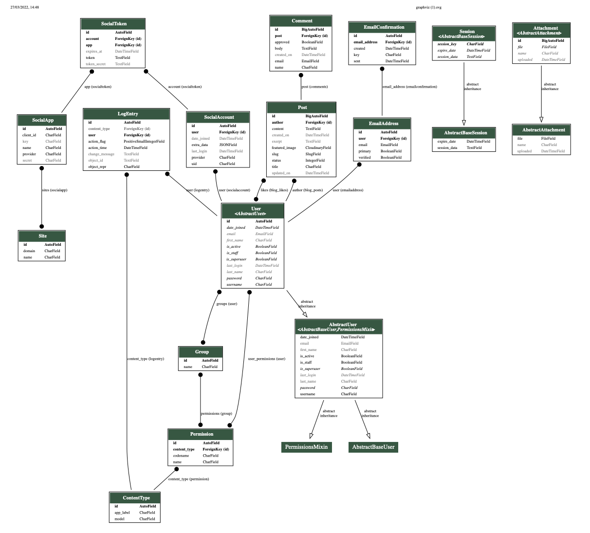

**Models**

* Post model

  * The Post model contians information about recipes posted to the website. 
  * It contains author as a foreign-key for the users table.
  * The model contains the following fields: title, slug, author, updated_on, content, featured_image, exerpt, created_on, status, and likes.

* Comment model 

  * The Comment model contains information about comments made on recipe posts.
  * It contains post as a foreign key for the Post table.
  * The model contains the following fields: post, name, email, body, created_on, approved. 

* User model

  * The User model contains information about the user. It is part of the Django allauth library.
  * The model contains the following fields: username, password, first_name, last_name, email, is_staff, is_active, is_superuser, last_login, date_joined.

The rest of the models were created automatically as part of a basic Django blog project. Their fields and relationships to the above models are illustrated in the above diagram. 

## Scope

* First Time Visitor Goals

  * As a First Time Visitor, I want to easily understand the main purpose of the site.
  * As a First Time Visitor, I want to be able to easily navigate throughout the site to find content.
  * As a First Time Visitor, I want to easily find basic information about the blog and its purpose.
 
* Returning Visitor Goals

  * As a Returning Visitor, I want to easily access recipes and share content.
  * As a Returning Visitor, I also want to locate the business's social media links to stay up to date with announcements and news.
  
* Frequent User Goals

  * As a Frequent User, I want to be able to access the site easily from any device, even if I am on the go.

* Site Owner Goals

  * As a site owner, I want to create an attractive and well-designed site that elicits a positive emotional response in users so that they remain on and navigate througout the site to achieve their goals.
  * As a site owner, I want maintain a safe and secure site where only registered users can share content and comment on other's posts, and where all posts are monitored for quality, and comments for inappropriate content.
  *  As a site owner, I want to have clear social media links displayed on the site which may lead to an increased following on channels to help with my blog's visibility.

More specific user stories are discussed in the context of website features in the Features section below.

Note: Throughout the project, [Kanban board](https://github.com/rocrill/crock-on/projects/1) was used to organise and track the progress of the user story development, however the final user stories are documented fully within this Readme. 

## Skeleton:

### Wireframes

Wireframe mock-ups were made using Balsamiq to help plan and visualise the site design. They were created for 2 main screen sizes: desktop and mobile.

Desktop:

- [Wireframes](docs/wireframes/home-desktop.pdf): Desktop 'Home' page.
- [Wireframes](docs/wireframes/about-desktop.pdf): Desktop 'About' page.
- [Wireframes](docs/wireframes/postdetail-desktop.pdf): Desktop post detail page.
- [Wireframes](docs/wireframes/randomrecipe-desktop.pdf): Desktop 'Random Recipe' page.
- [Wireframes](docs/wireframes/sharerecipe-desktop.pdf): Desktop 'Share Recipe' page.
- [Wireframes](docs/wireframes/searchpage-desktop.pdf): Desktop 'Search' page.
- [Wireframes](docs/wireframes/register-desktop.pdf): Desktop 'Register' page.
- [Wireframes](docs/wireframes/login-desktop.pdf): Desktop 'Sign in' page.
- [Wireframes](docs/wireframes/signout-desktop.pdf): Desktop 'Sign out' page.

Mobile:

- [Wireframes](docs/wireframes/mobile-home-nav-dropdown.pdf): Mobile 'Home' page.
- [Wireframes](docs/wireframes/mobile-about.pdf): Mobile 'About' page.
- [Wireframes](docs/wireframes/postdetail-mobile.pdf): Mobile post detail page.
- [Wireframes](docs/wireframes/randomrecipe-mobile.pdf): Mobile 'Random Recipe' page.
- [Wireframes](docs/wireframes/sharerecipe-mobile.pdf): Mobile 'Share Recipe' page.
- [Wireframes](docs/wireframes/register-mobile.pdf): Mobile 'Register' page.
- [Wireframes](docs/wireframes/login-mobile.pdf): Mobile 'Sign in' page.
- [Wireframes](docs/wireframes/signout-mobile.pdf): Mobile 'Sign out' page.

## Surface

### Design:

* Colour Scheme:

  The colour palette includes fun and complimenting colours. The palette was chosen using the [Coolors](https://coolors.co/) colour generator website.

  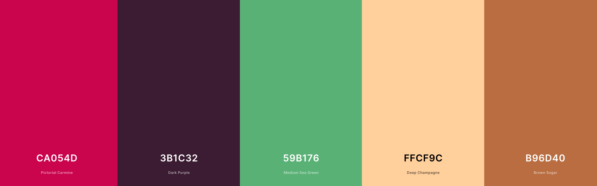

  The colours mainly used were:

  White was also used in different parts of the site to achieve the best possible contrast for user experience.

* Typography:

  'Bungee Shade and Roboto Slab', taken from Google Fonts, are the main fonts used throughout the website with 'Sans Serif' as the fallback font. The Bungee Shade font is eye-catching and fun, and this is used for the blog logo and recipe titles. The Roboto Slab is clean, neat and more approriate for the smaller text used throughout the site.

* Imagery:

  All images were sourced from [Unsplash](https://unsplash.com/).

  The selection of recipe images were chosen to convey variety and colour, to make the recipes appear appetising. When users upload their own recipes they also have the possiblity of adding their own images. If any images are poor quality the website admin can contact the user and provide alternative suggestions if necessary to preserve the quality of the recipe listing UI.

------

## Features

### Existing Features:

Feature 1. Navigation bar

  * Navigation bar is always at the top of the page so users know what to expect and can navigate easily.

  * A border appears at the bottom of the menu links when they are hovered over for responsiveness.

  * On mobile, the navigation menu links are within a collapsed drop down menu instead of in-line.

  Desktop:

  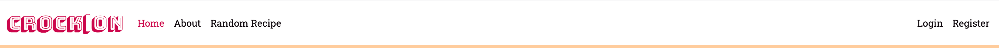

  Mobile:

  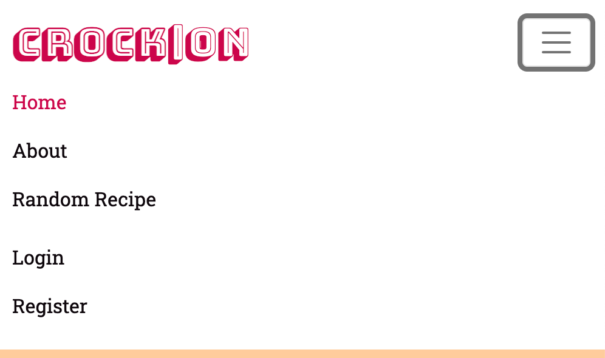
  
User stories relating to Navigation bar and footer:

  * 1.1 As a user the navigation bar is displayed with a logo on all pages with a search box on a desktop, tablet and mobile.
  * 1.2 As a user not logged in, I see a Register/Login link in the nav bar. Clicking this leads me to the appropriate registration or sign in pages and enable me to register and sign in,
  * 1.3 As a logged in user, I am notified when I am logged in and I see a logout link in the nav which enables me to click sign out which logs me out.
  * 1.4 As a user I can view the Home link in the header, as well as the website logo, and clicking both will bring me to the homepage.
  * 1.5 As a user I can click the ‘Share Recipe’ nav link which brings me to the recipe posting page where I am able to create a post.
  * 1.6 As a user I can click the ‘Random Recipe’ link which takes me to the page where a new random recipe is displayed each time I visit it.
  * 1.7 As a user if I encounter an error on the site, I will be navigated to the applicable 400, 403, 404 or 500 error page

Feature 2. Home page which contains the recipe list.

  * The recipe list is neat and well-proportioned. Each post clearly states the title, author name and no. of likes and comments received.
  * The home page is paginated so that when more than 6 recipes are published on the site, the second page appears for additional recipes.

  Desktop:

  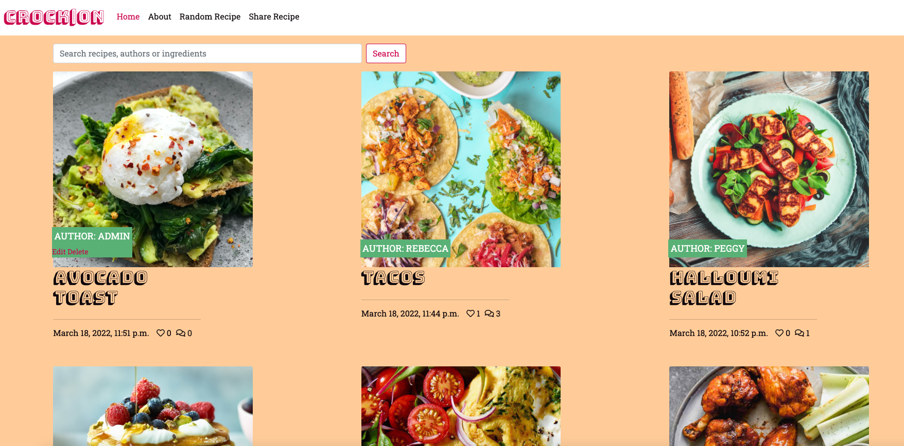

  Mobile:

  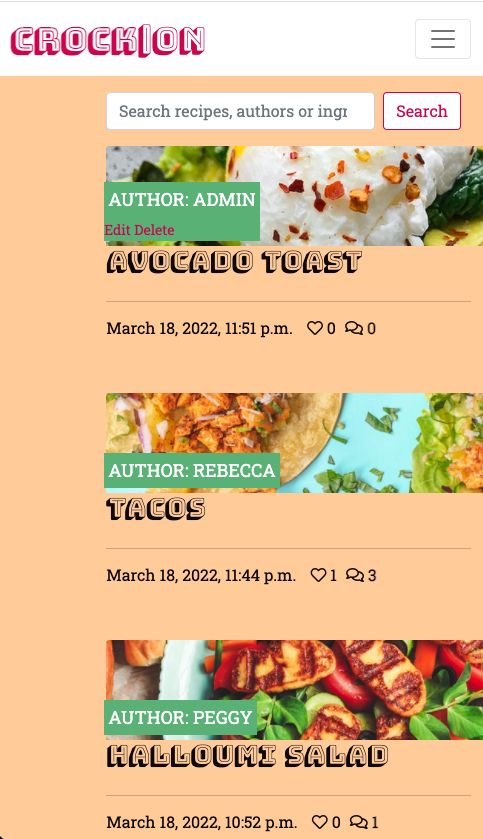

User stories relating to home page.

  * 2.1 As a user, I want to see a list of recipes with visually appealing images, listing clear titles and the post authors. 
  * 2.2 As a returning user, I want to see the newest recipes displayed in date order with the most recent postings first on the page:
  * 2.3 As a user, I want to see the number of comments and number of likes displayed on each recipe card on the post detail page, so that I have an idea of the popularity and engagement of a post when deciding which ones to look at.  
  * 2.4 As a user and post author, I want to be able to edit or delete a recipe post for which I am the author. 
  * 2.5 As a user if there are more than six recipes on the page, the page is paginated with six recipes per page.

Feature 3. Recipe post detail page

  * This contains a header with the post title, author name and date of posting. Links to edit and delete the post will also appear here if it is the post author logged in. 
  * Below this is the main image of the recipe and below this is the recipe post itself, which is in the format of an ingrdients list and method. Most users post in this format, however if not, a website admin will re-format the instructions if needed when reviewing the post for quality after it is posted as a draft.
  * Below the reecipe are user comments and the comment box will also appear here for authenticated logged in users. When a valid user submits a valid comment form, they receive a notification that their comment is awaiting approval. Once this is approved by admin the comment will appear under the post.
  * There is also a number of comments and number of likes displayed on the post detail page. 

  Desktop:
  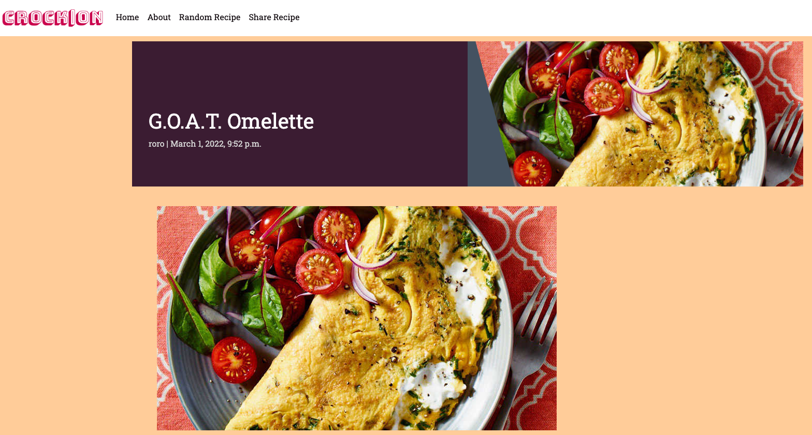
  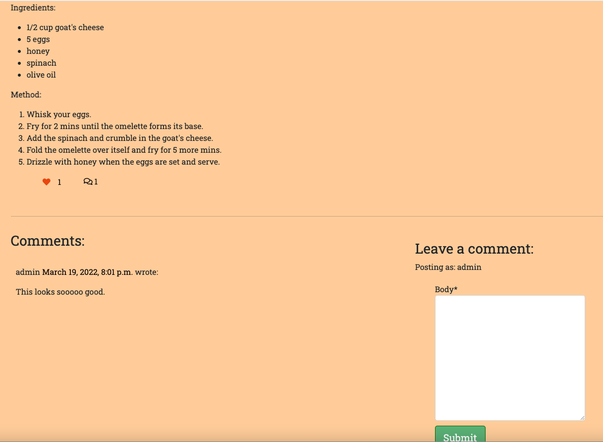

  Mobile:
  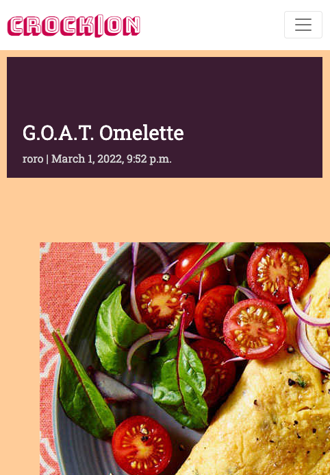
  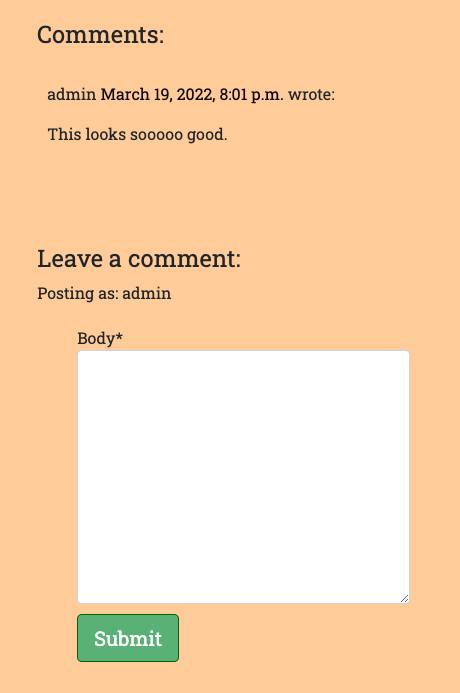

User stories relating to recipe post detail page:

  * 3.1 I want to be able to edit or delete a recipe post for which I am the author.
  * 3.2 As a user, I want to be able to comment on a recipe post
  * 3.3 As a user, I want to be able to like and unlike a recipe post.
  * 3.4 As a user who has not registered or logged into the website, I cannot add a comment to a recipe post.
  
Feature 4. Random Recipe page

  * The random recipe page is a page which generates a new random recipe each time the user visits it. It contains the recipe card as displayed on the home page, containing the recipe image, title, author name, number of likes and comments and posting date.

  Desktop:

  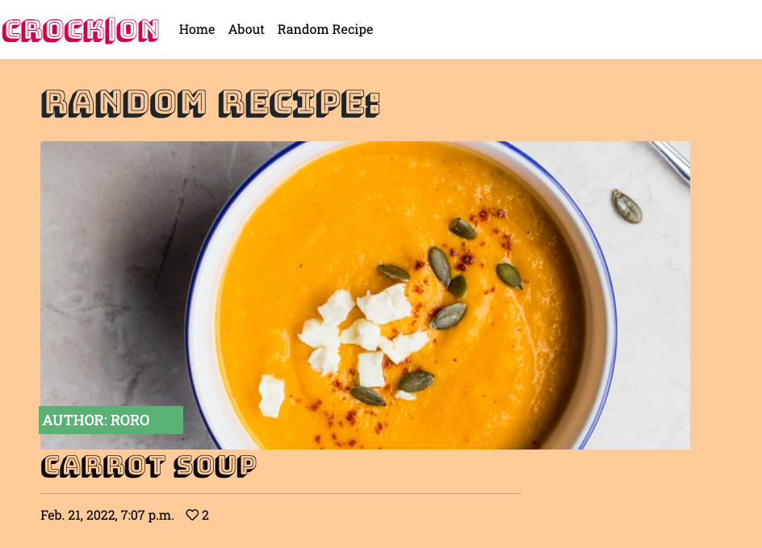
  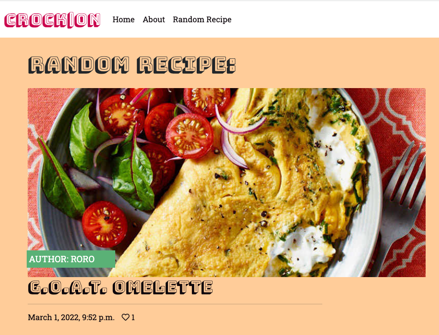

  Mobile: 

  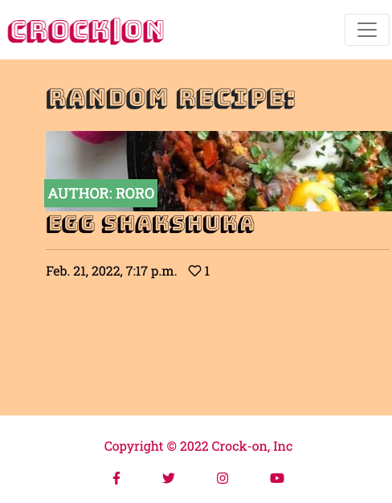

User stories relating to recipe Random Recipe page:

  * 4.1 As a user, I want quick and easy inspiration for cooking ideas without browsing through a large number of recipes.

Feature 5. About page

  * This seciton provides a brief background of the blog, its purpose and a welcoming message for website users.
  
  Desktop:

  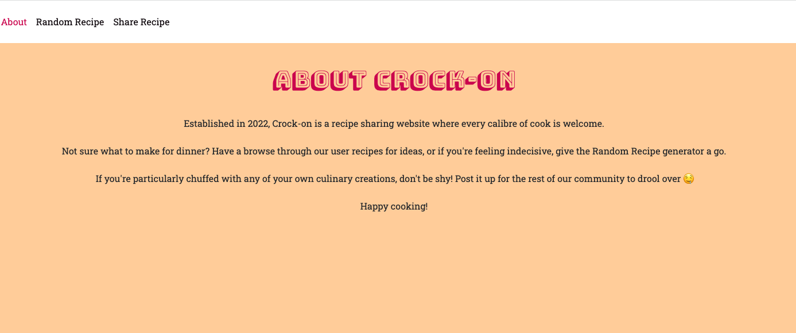

  Mobile:

  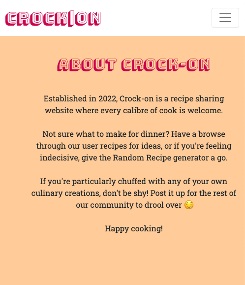

User stories relating to the About page:

  * 5.1 As a user I can read about the background to and idea behind the website so that I understand the website style and purpose.

Feature 6. Footer

  * Footer is conventionally placed at the bottom of the site and consistently displayed on all pages.

  * It includes centered social media links which open in new tabs. 

  * The aim is for a clean and minimalist look for the footer.

  Desktop: 

 

  User stories relating to the footer:

  * 6.1 As a user, I can access the blog site's social media pages which open in new tabs so that I can stay updated on blog news and updates.

Feature 7. Share Recipe page

  * This is minimal, with the form located in the centre of the page.
  * The recipe posting form has the option for the user to attach their own recipe image, along with a title, unique slug and recipe content.
  * Django Summernote enables the user to format their recipe post, e.g. be adding bullet points or bold headings when creating their content.

  Desktop:

  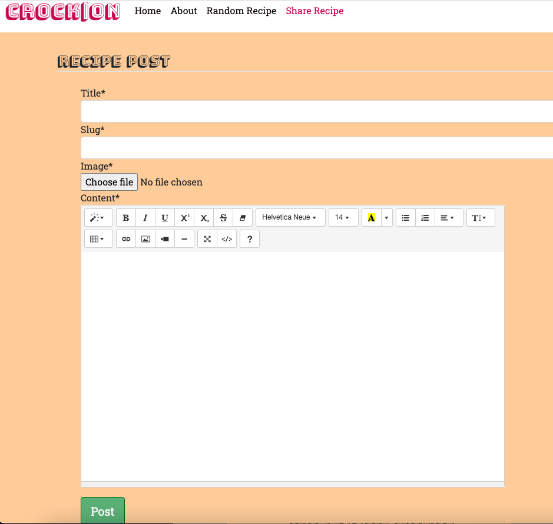

  Mobile:

  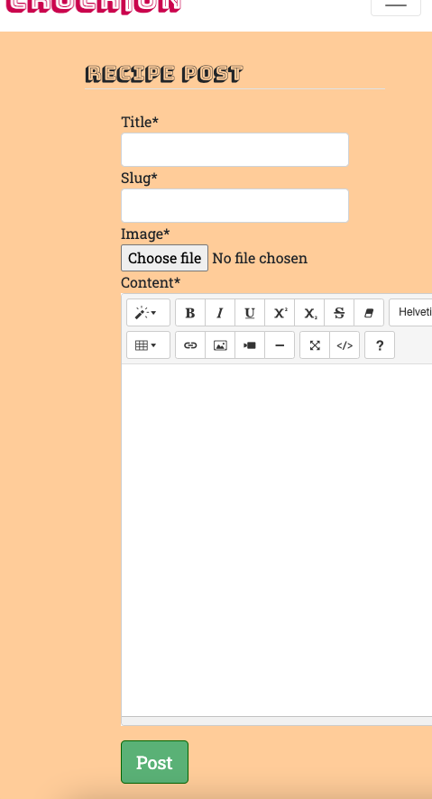

User stories relating to the Share Recipe page:

 * 7.1 As a user, I can create a recipe post from the front end of the site so that I can easily post a recipe without having to access the back-end of the site.

Feature 8. Register/Log in and Log out pages:

  * These three pages have a similar layout. Each function is located in the centre of the page.
  * There is user validation when filling out the forms and upon signing out the user is asked if they are sure they would like to do so.
  * Registration, signing in and logging out all result in a confirmation message of the action completed to the user.

  Desktop:

  
  
  

  Mobile:

  
  
  

 User stories relating to Register/Log in and Log out pages:

  * 8.1 As a user I can log in to the site via the log in page so that I can use the site and all features available to an authenticated user:
  * 8.2 As a first time user I can register and sign up to the site via the register page so that I can use the site and all features available to an authenticated user:
  * 8.3 As a user I can log out of the site when logged in so that I can securely end my session on the site.

Feature 9. Admin

  * A number of Admin views are configured at https://crock-on.herokuapp.com/admin, through which the below user stories can be carried out. Full CRUD operations to the data in the database are available as well as search and filter options. These include a Users lists, Posts and Comments.

  Users:
  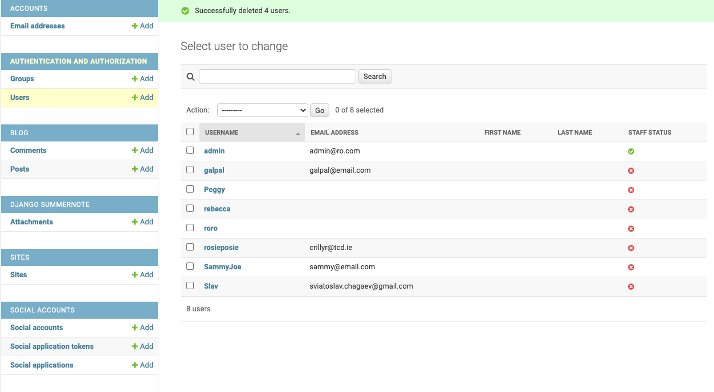

  Posts:
  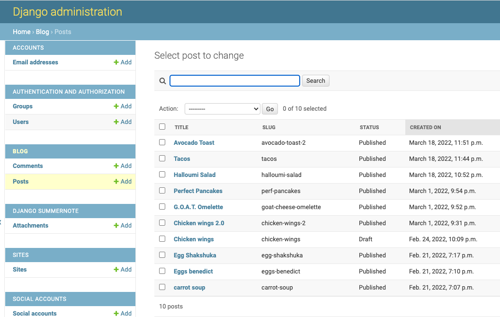

  Comments:
  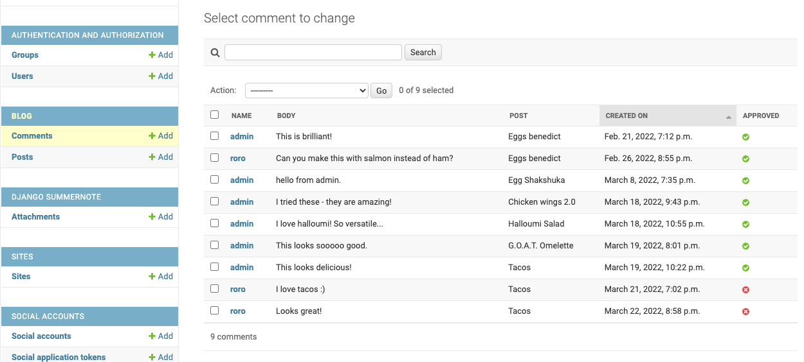 

User stories relating to Admin:

  * 9.1 As an admin user, I can view all user draft posts in date order so that all posts can be reviewed for quality and appropriateness.
  * 9.2 As an admin user, I can edit and publish all user draft posts so that all posts can be reviewed for quality and appropriateness. 
  * 9.3 As an admin user, I can view and approve all user comments so that all commets can be reviewed for appropriateness.
  * 9.4 As an admin user, I can view all comments in date order, along with the name of the recipe post that they correspond to and the username of the commenter, so that I can easily view an organised list of comments.
  * 9.5 As an admin user, I filter all posts by status and time of creation so that I can easily filter to view the posts that I need to access.
  * 9.6 As an admin user I can delete posts so that I can remove old/unpublished posts form the database.
  * 9.7 As an admin user I can create a new post via the admin page so that I can post directly to the site without having to access the frontend.

### Features To be Implemented in Future:

* Recipe list page: 
* Recipe detail page: Rating feature
* Tag posts with categories e.g. vegetarian vegan so user can search by these terms.
* Paginate comments

## Technologies Used

### Languages:

*  [HTML 5](https://en.wikipedia.org/wiki/HTML5)
*  [CSS 3](https://en.wikipedia.org/wiki/CSS)
*  [Javascript](https://www.javascript.com/)
*  [Django]((https://www.djangoproject.com/)
*  [Python](https://www.python.org/)

Python was used for the project's server side coding, in addition to a number of libraries. This is the list as per the requirements.txt file:
asgiref==3.5.0
dj-database-url==0.5.0 (Support for DATABASE_URL environment variable)
cloudinary==1.28.1
dj3-cloudinary-storage==0.0.6
Django==3.2 (Web framework)
django-allauth==0.48.0 (Web framework authentication)
django-crispy-forms==1.14.0 (Django rendering of forms)
django-summernote==0.8.20.0
django-autoslug==1.9.8
gunicorn==20.1.0 (Python WSGI Http server)
oauthlib==3.2.0 (Framework for oauth1 and oauth2)
psycopg2==2.9.3
PyJWT==2.3.0
python3-openid==3.2.0 (Support for the OpenID decentralized identity system)
pytz==2021.3
requests-oauthlib==1.3.1 (Authentication support for Requests)
sqlparse==0.4.2 (Non-validating SQL parser for Python)

### Frameworks, libraries and programs used:

* [Balsamiq](https://balsamiq.com/) - to create wireframes for the site as part of the project preparation.
* [Google Fonts](https://fonts.google.com/) - to import the 'Kaisei HarunoUmi' and 'Sans Serif' fonts into the HTML file, which were then used throughout the site.
* [Font Awesome](https://fontawesome.com/) - for icons which were added to some headings throughout the site for aesthetics.
* [Coolors](https://coolors.co/) - for an appropriate and attractive colour palette.
* [Chrome DevTools](https://developer.chrome.com/docs/devtools/) - to inspect and debug the code through all stages of the development.
* [Lighthouse](https://developers.google.com/web/tools/lighthouse) - to check the site for performance, accessibility and best practices.
* [Am I Responsive](http://ami.responsivedesign.is/) - to produce a preview of the site on different devices.
* [W3C HTML Validator](https://validator.w3.org/#validate_by_input) - to validate HTML code.
* [W3C CSS Validator](https://jigsaw.w3.org/css-validator/) - to validate CSS code.
* [GitHub](https://github.com/) - for hosting the project code and version control.
* [Gitpod](https://gitpod.io/account) - to write the code and push it to GitHub.
* [Github Pages](https://pages.github.com/) - to deploy the site.
* [Unsplash](https://unsplash.com/) - for images.
* [Bootstrap]
* [Postgres]
* [SQL lite]

# Deployment

This site has been deployed on Heroku. The link is: https://crock-on.herokuapp.com/

## Deployment on Heroku

1. Create a new Heroku app:

* Select 'create new app' under 'new'. Name the app and select a location.
* Under the Heroku Resources tab, search the database, e.g. Heroku Postgres, and add it to Resources.
* Navigate to the settings tab of Heroku, click reveal Convig Vars and copy the DATABASE_URL value. 

2. Attach the database:

* To attach the database, in Gitpod, create a new env.py file on the top level directory.
* In env.py, import os library and set environment variables:
  os.environ["DATABASE_URL"] = "Paste in Heroku DATABASE_URL Link"
* Then add in a secret key:
  os.environ["SECRET_KEY"] = "Make up your own randomSecretKey"
* In Heroku.com, add the Secret Key to your Config Vars:
  SECRET_KEY, “randomSecretKey”

3. Prepare environment and settings.py file:

* Update the settings.py file to import the env.py file. Add the SECRETKEY and DATABASE_URL file paths.
* Save all files and make migrations in the terminal with `python3 manage.py migrate`.

4. Get static and media files stored on Cloudinary:

* Take Cloudinary url from the Cloudinary dashboard. 
* Add the the Cloudinary url into the env.py file.
* Update the Config Vars in Heroku with the Cloudinary url.

In settings.py add the following sections:
- Cloudinary to the 'INSTALLED_APPS' list
- STATICFILE_STORAGE
- STATICFILES_DIRS
- STATIC_ROOT
- MEDIA_URL
- DEFAULT_FILE_STORAGE
- TEMPLATES_DIR
- Update DIRS in TEMPLATES with TEMPLATES_DIR
- Update ALLOWED_HOSTS with ['crock-on.heroku.com', 'localhost']

In Gitpod:

* Create 3 new folders on the top level directory: media, static and templates.
* Create a Procfile on the top level directory. 
* Add 'web: gunicorn project-name.wsgi' to the Procfile.
* Go to the Deploy tab on Heroku and connect to GitHub, then to the required repository. Click on Deploy Branch and wait for the build to load. When the build is complete, the app can be opened through Heroku.

## Forking the Repository

You can create a fork (copy) of the repository. This allows you to experiment with the code without affecting the original project.

To fork the repository:

* Log in to your GitHub account.
* On GitHub, navigate to the repository you want to fork.
* In the top right corner of the page, underneath your profile avatar, click Fork.
* You should now have a copy of the original repository in your GitHub account.

## Making a local clone

You can clone your repository to create a local copy on your computer. Any changes made to the local copy will not affect the original project. To clone the crock-on project, follow the steps below:

* Select the repository rocrill/crock-on. In the repository, click on Code button located above all the project files.
* Under HTTPS, copy the link generated - https://github.com/rocrill/crock-on. Open the terminal you are using, e.g. Gitpod.
* Change the current working directory to the location where you want the cloned directory created.
* Type git clone and then paste the URL you copied earlier: git clone https://github.com/rocrill/crock-on. Press Enter to create your local clone.

# Testing

I tested the site regularly during the development process, by previewing it in the live server window and inspecting with Google Chrome DevTools at various stages.

When I was editing for responsiveness I tested the site on several different devices.

At the final stages of the project the W3C Markup Validator, W3C CSS Validator Services, along with PEP8 and JSHint were used to validate every page of the project to ensure there were no syntax errors.

## Testing User Stories 

* First Time Visitor Goals

  * As a First Time Visitor, I want to easily understand the main purpose of the site.
  * As a First Time Visitor, I want to easily find basic information about the blog and its purpose.

  Result: Pass

  The 'About' section of the site clearly outlines the idea behind the site's purpose and the features available.

  * As a First Time Visitor, I want to be able to easily navigate throughout the site to find content.

  Result: Pass

  The navigation bar is consistent across the site, the nav link titles are clear and intuitively ordered, e.g. the login/logout link placement on the right hand side.
 
* Returning Visitor Goals

  * As a Returning Visitor, I want to easily access recipes and share content.

  Result: Pass

  Recipes are located on the home page and the 'Share Recipe' page is clearly named in the nav bar for logged in users who wish to share content.

  * As a Returning Visitor, I also want to locate the business's social media links to keep up to date with blog news and announcements.

  Result: Pass

  These can be found and accessed via the website footer.
  
* Frequent User Goals

  * As a Frequent User, I want to be able to access the site easily from any device, even if I am on the go.

  Result: Pass

  The site is fully responsive and optimised for mobile as well as dektop devices.

* Site Owner Goals

  * As a site owner, I want to create an attractive and well-designed site that elicits a positive emotional response in users so that they remain on and navigate througout the site to achieve their goals.

  Result: Pass

  The color scheme, design and images were chosen to create an attractive site that will interest users in searching through the recipes and site pages. 

  * As a site owner, I want maintain a safe and secure site where only registered users can share content and comment on other's posts, and where all posts are monitored for quality, and comments for inappropriate content.

  Result: Pass

  Users are authenticated before they can share content, or comment on and like posts. This is tested in more detail in the feature-specific user stories below. All posts are also approved by the site admin team before being published to ensure that the site content is safe for all users.

  *  As a site owner, I want to have clear social media links displayed on the site which may lead to an increased following on channels to help with my blog's visibility.

  Result: Pass

  These are clearly located in the website footer.

Feature User Story testing:

1. Navigation bar and footer:

  * 1.1 As a user the navigation bar is displayed with a logo on all pages with a search box on a desktop and mobile.

    

    

    Result: Pass

  * 1.2 As a user not logged in, I see a Register/Login link in the nav bar. Clicking this leads me to the appropriate registration or sign in pages and enable me to register and sign in.
    
    (i)
    (ii)-(a)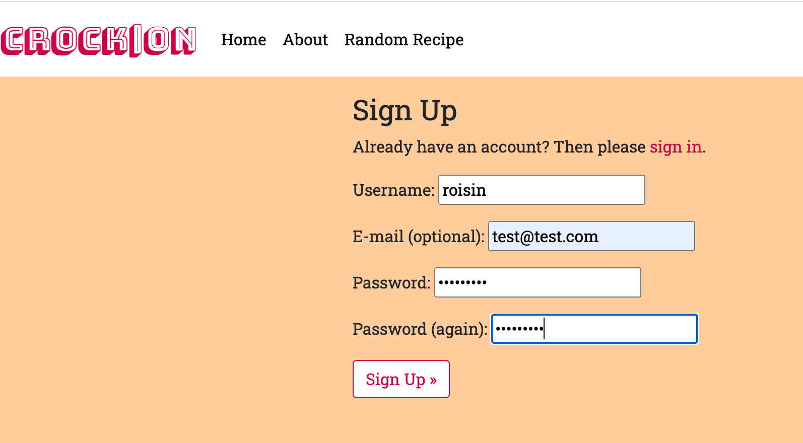
    (ii)-(b)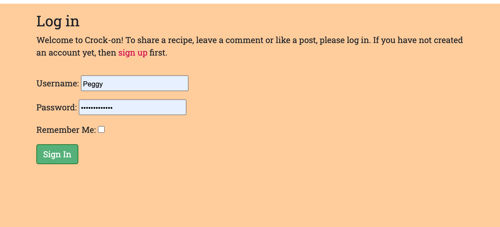
    (iii)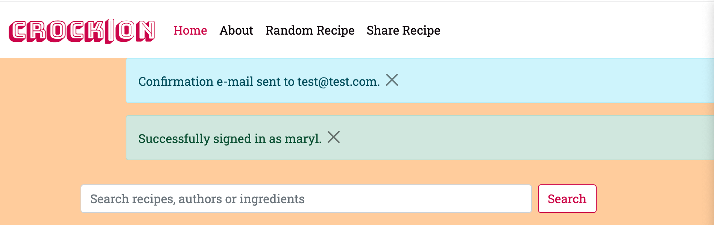

    Result: Pass 

  * 1.3 As a logged in user, I am notified when I am logged in and I see a logout link in the nav which enables me to click sign out which logs me out.

    (i)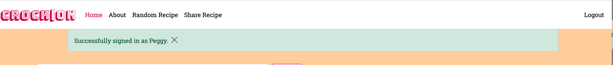
    (ii)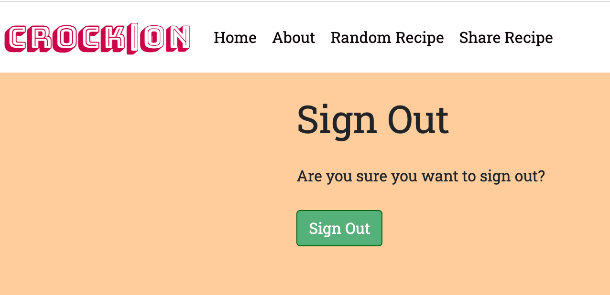
    (iii)

    Result: Pass

  * 1.4 As a user I can view the Home link in the nav bar, as well as the website logo, and clicking both will bring me to the homepage.

    (i)
    (ii)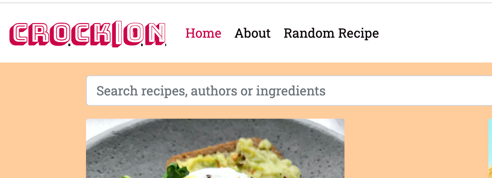

    Result: Pass

  * 1.5 As a user I can click the ‘Share Recipe’ nav link which brings me to the recipe posting page where I am able to create a post.

    (i)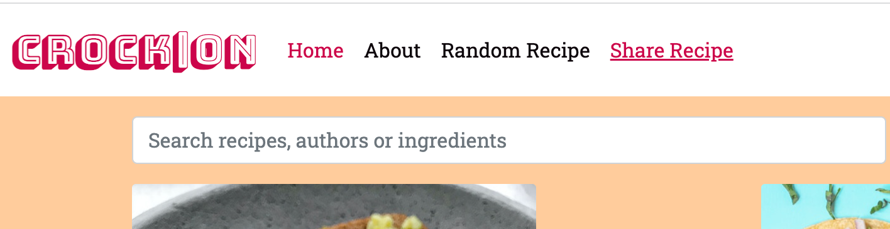
    (ii)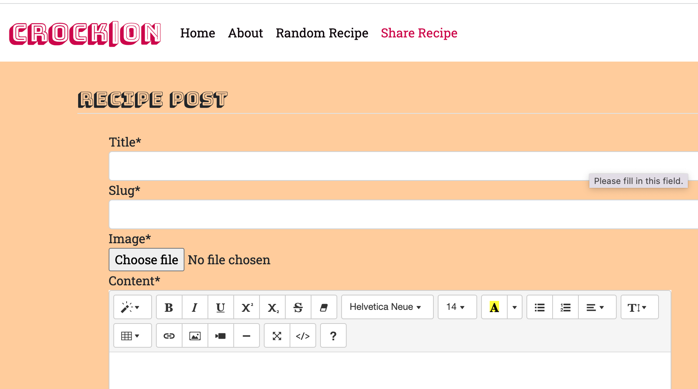
    (iii)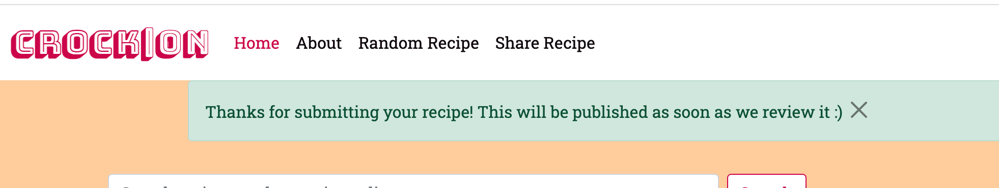

    Result: Pass

  * 1.6 As a user I can click the ‘Random Recipe’ link which takes me to the page where a new random recipe is displayed each time I visit it.

   (i)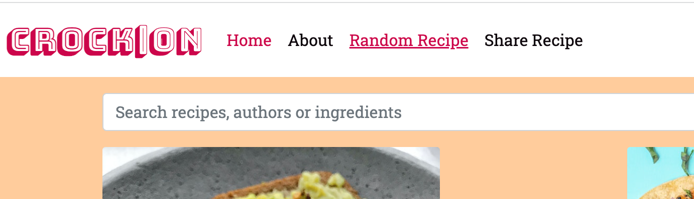
   (ii)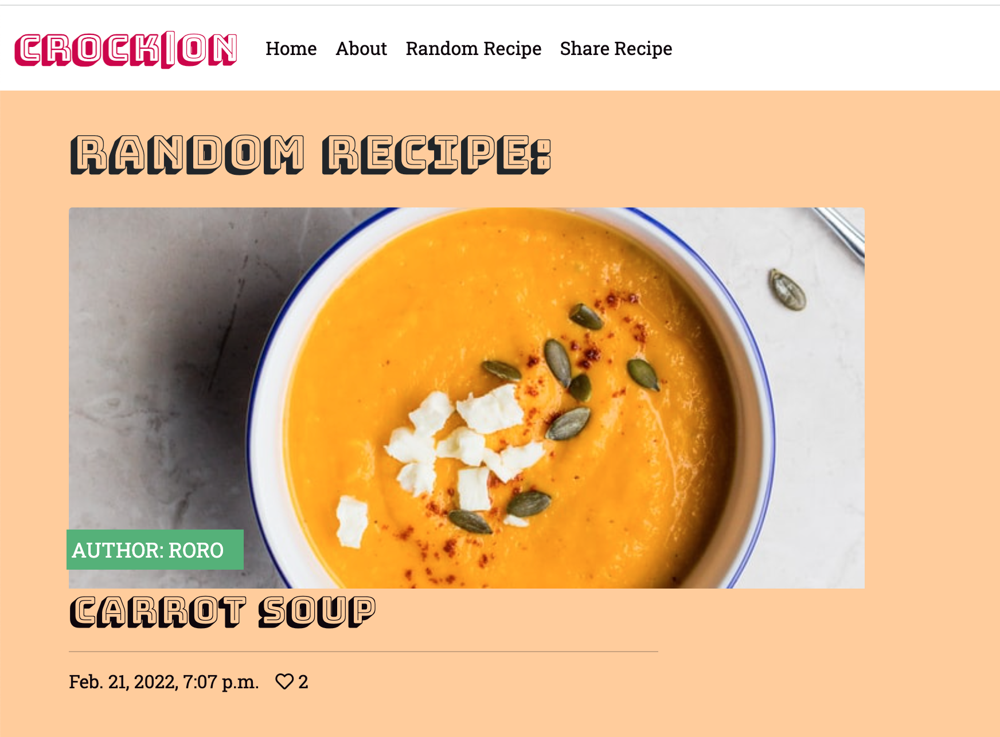

   Result: Pass

  * 1.7 As a user if I encounter an error on the site, I will be navigated to the applicable 400, 403, 404 or 500 error page
  
        To do

   Result: Pass

2. Home page which contains the recipe list.

  * 2.1 As a user, I want to see a list of recipes with visually appealing images, listing clear titles and the post authors. 

    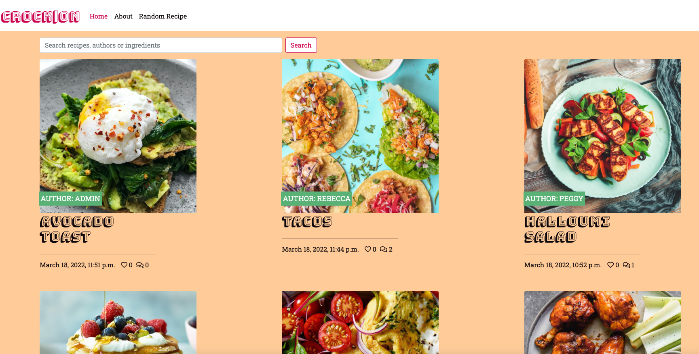

    Result: Pass

  * 2.2 As a returning user, I want to see the newest recipes displayed in date order with the most recent postings first on the page:

    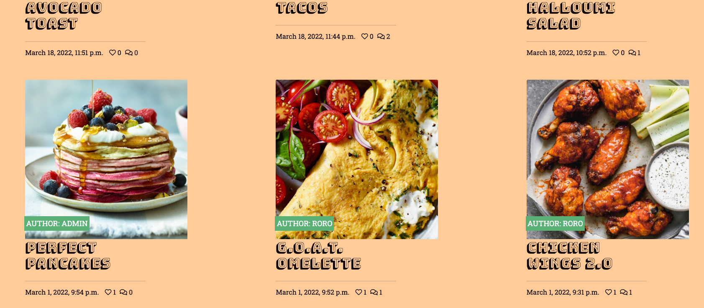

    Result: Pass

  * 2.3 As a user, I want to see the number of comments and number of likes displayed on each recipe card on the post detail page, so that I have an idea of the popularity and engagement of a post when deciding which ones to look at.  

    

    Result: Pass

  * 2.4 As a user and post author, I want to be able to edit or delete a recipe post for which I am the author. 

    (i)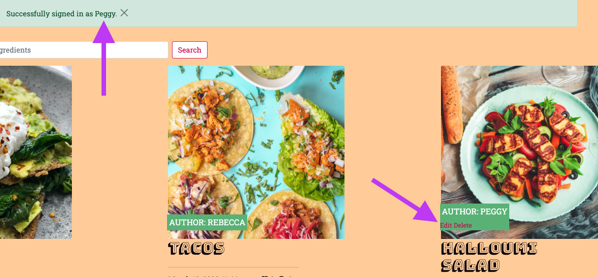
    (ii)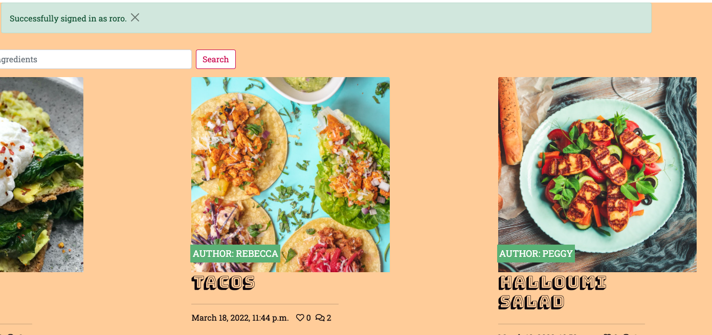

    Result: Pass
  
  * 2.5 As a user if there are more than six recipes on the page, the page is paginated with six recipes per page.

    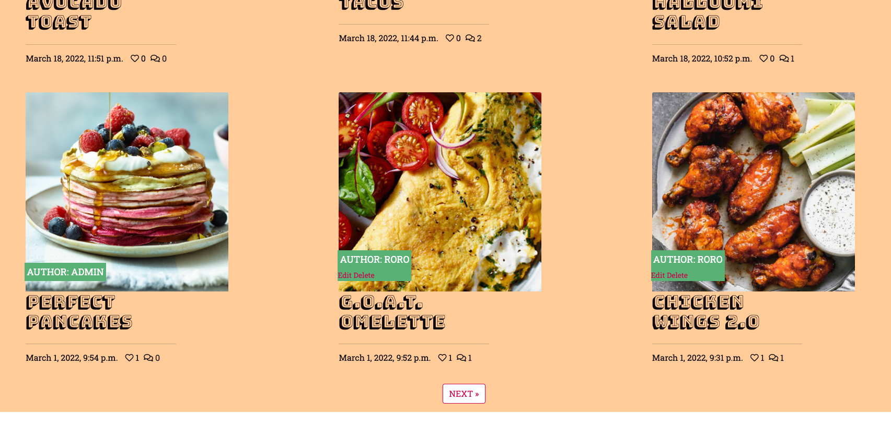

    Result: Pass

3. Recipe post detail page.

  * 3.1 I want to be able to edit or delete a recipe post for which I am the author.

    (i)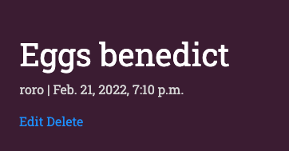
    (ii)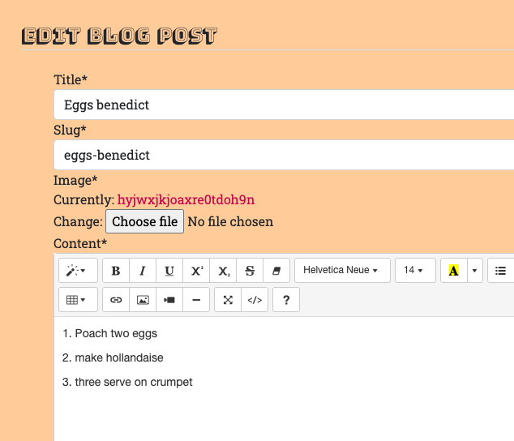

    Result: Pass

  * 3.2 As a user, I want to be able to comment on a recipe post

    (i)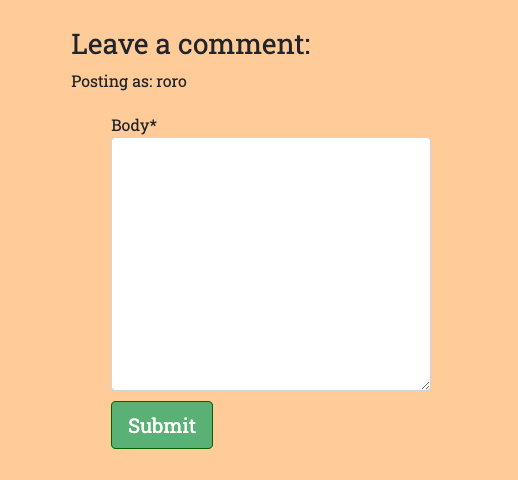
    (ii)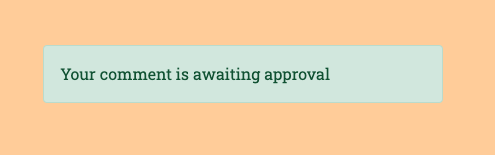

    Result: Pass

  * 3.3 As a user, I want to be able to like and unlike a recipe post.

    (i)

    Result: Pass

  * 3.4 As a user who has not registered or logged into the website, I cannot add a comment to a recipe post.

    (i)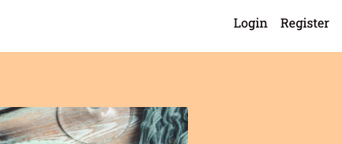
    (ii)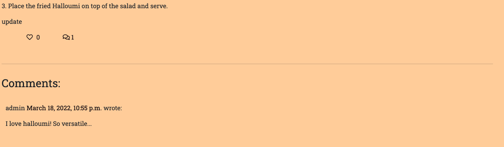

    Result: Pass

4. Random Recipe page

  * 4.1 As a user, I want quick and easy inspiration for cooking ideas without browsing through a large number of recipes.

    (i)
    (ii)

    Result: Pass

5. About page

  * 5.1 As a user I can read about the background to and idea behind the website so that I understand the website style and purpose.

    

    Result: Pass

6. Footer

  * 6.1 As a user, I can easily access the blog site's social media pages which open in new tabs so that I can stay updated on blog news and updates.

    

    Result: Pass

7. Share Recipe page

  * 7.1 As a user, I can create a recipe post from the front end of the site so that I can easily post a recipe without having to access the back-end of the site.

    (ii)
    (iii)

    Result: Pass

8. Register/Log in and Log out pages:

  * 8.1 As a user I can log in to the site via the log in page so that I can use the site and all features available to an authenticated user:

    (i)
    (ii)

    Result: Pass 

  * 8.2 As a first time user I can register and sign up to the site via the register page so that I can use the site and all features available to an authenticated user:

   (i)
   (ii)

   Result: Pass

  * 8.3 As a user I can log out of the site when logged in so that I can securely end my session on the site.

    (i)
    (ii)

     Result: Pass

9. Admin

  * 9.1 As an admin user, I can view all user draft posts in date order so that all posts can be reviewed for quality and appropriateness.

    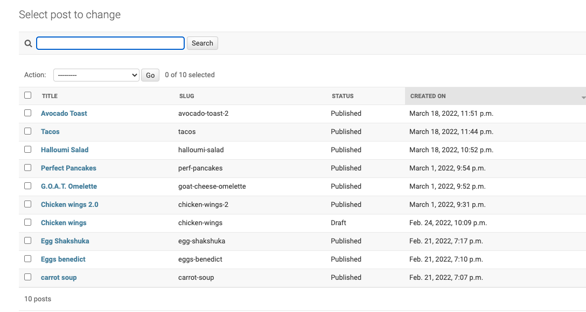

    Result: Pass

  * 9.2 As an admin user, I can edit and publish all user draft posts so that all posts can be reviewed for quality and appropriateness. 

    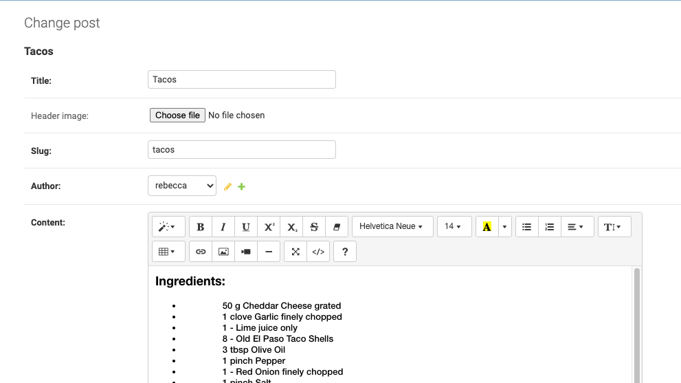
    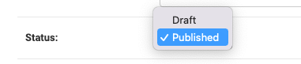

    Result: Pass

  * 9.3 As an admin user, I can view and approve all user comments so that all commets can be reviewed for appropriateness.

   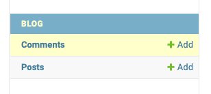
   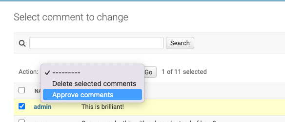

    Result: Pass

  * 9.4 As an admin user, I can view all comments in date order, along with the name of the recipe post that they correspond to and the username of the commenter, so that I can easily view an organised list of comments.

   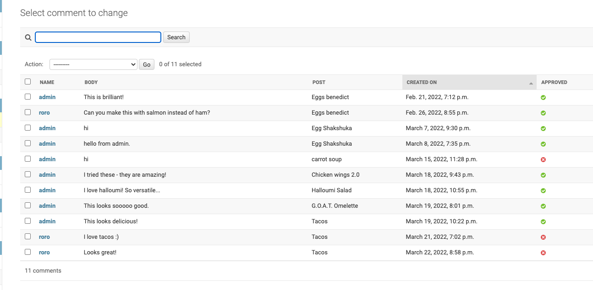

    Result: Pass

  * 9.5 As an admin user, I filter all posts by status and time of creation so that I can easily filter to view the posts that I need to access.

    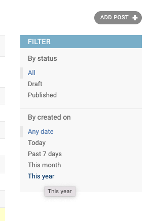

    Result: Pass

  * 9.6 As an admin user I can delete posts so that I can remove old/unpublished posts form the database.

    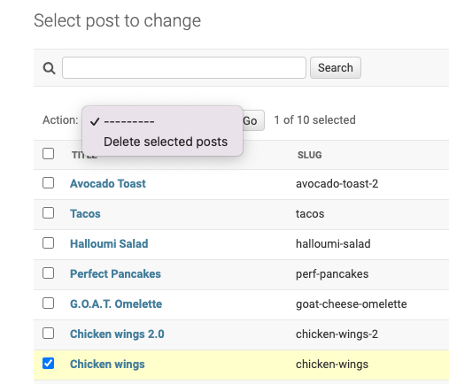
    

    Result: Pass

  * 9.7 As an admin user I can create a new post via the admin page so that I can post directly to the site without having to access the frontend.

    
    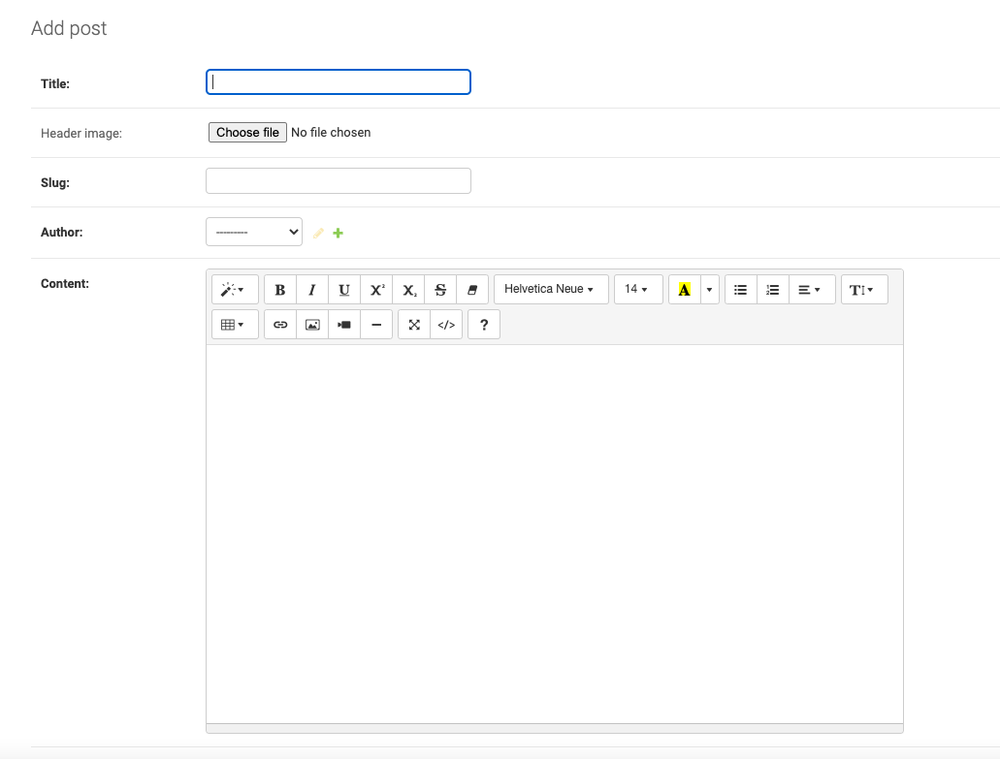

    Result: Pass

## Validator Testing

* HTML Validator Errors & Warnings:

  * Error: An `img` element must have an `alt` attribute, except under certain conditions.
  * Fix: `alt` attributes added to all image elements.

  * Error: Stray end tag `span`.
  * Fix: Stray end tag deleted.

  * Warning: Consider adding a `lang` attribute to `html` start tag to declare the language of this document.
  * Fix: `lang` attribute added to `html` start tag.

  * Summernote errors: The 'Share recipe' and 'Update recipe' pages both result in the following errors due to the Django Summernote text editor. These errors cannot be fixed since they are caused by an external library:

  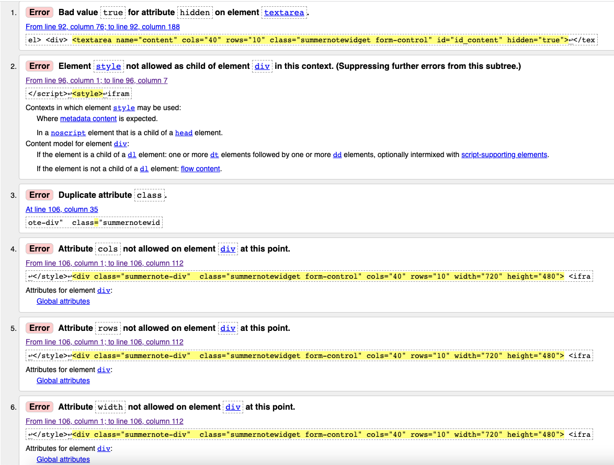
  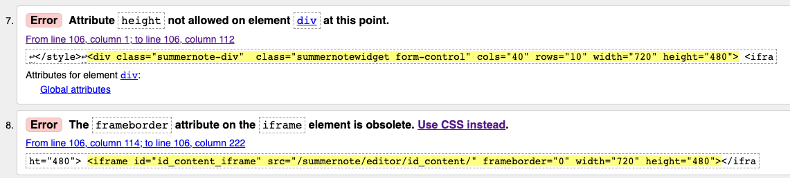

* CSS Validator Errors & Warnings

  * Error: 'Text decoration `bold` is not a `text-decoration` value'.
  * Fix: Removed `text-decoration` from class as it was not needed in the end.

I re-ran the deployed site through both the HTML and CSS validators and no warnings or errors were found:

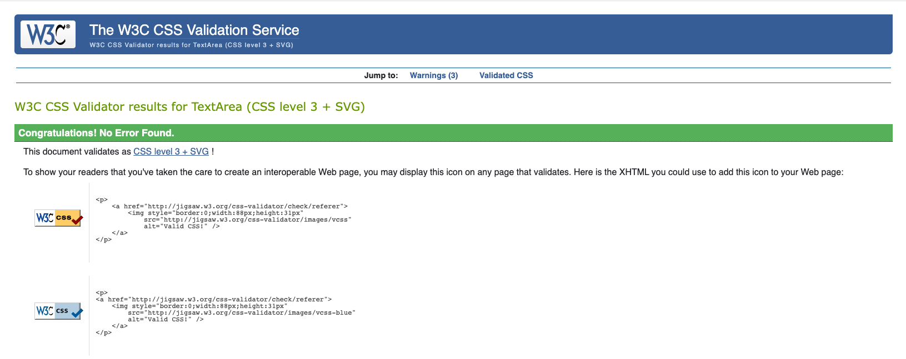

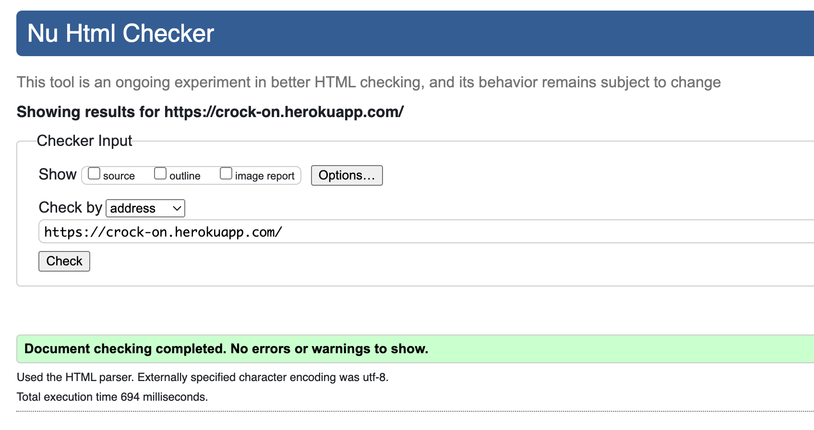

The source code for each website page was also run through the HTML validator separately and no errors were returned except for those relating to Summernote, as noted above.

## Lighthouse Testing

The Lighthouse report from Google Chrome DevTools showed good results for performance and accessibility of the site, particularly on desktop devices.

Home page: 
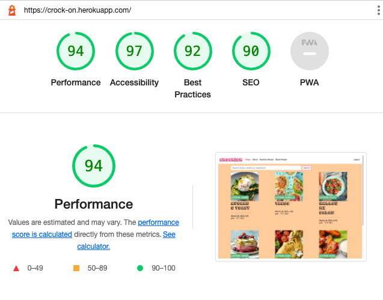
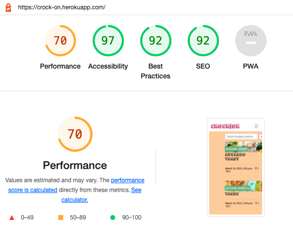

About page:
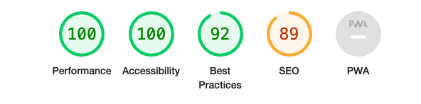

Share recipe page:
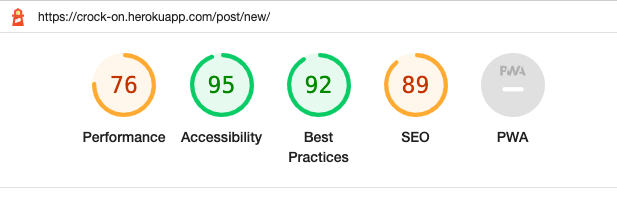
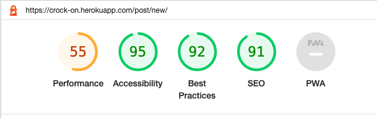

Random Recipe page:
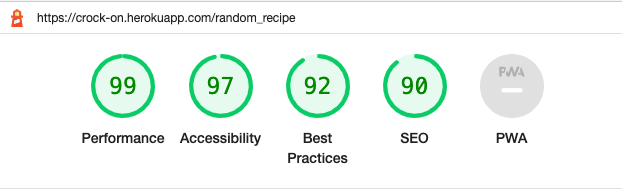
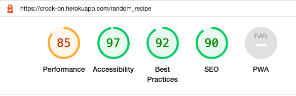

Post detail page:
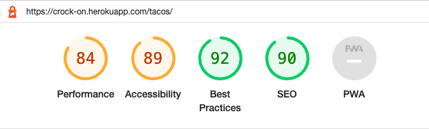
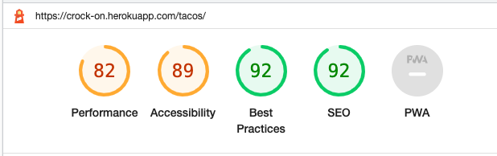

## Further Testing

* Devices and browsers :

  * The Website was tested on multiple browsers - Google Chrome, Safari, Microsoft Edge and Firefox browsers.
  * The website was viewed on all devices available to me - Desktop, Laptop, iPhone6, Huawei Y6 and Oppo Find X2 Lite.

* Site Features:

  * The nav bar remains and the top of the page and the menu items adapt to remain within the nav bar on all devices.
  * The font is legible on all device sizes.
  * Images are resized where needed and never stretched or distorted on smaller devices.
  * All buttons and links direct to the correct parts of the site.

## Bugs

* Fixed:

  * Search feature: This was originally case sensitive, e.g. if a recipe was entitled 'Egg's Benedict', it would not appear in search results if a user searched 'egg' instead of 'Egg'. This was fixed by using `icontains` in the search view instead of `contains`.
  * The Random Recipe page was originally generating draft posts as random recipes as well as published posts. To address this, a filter was added to the `search_recipes` view so that only posts with published status would be shown in results.
  * Initially, when posts were created the user was directed to a 'success url' which contained a confirmation message that their post was submitted. However this message would remain everytime the user navigated back to the home page after posting. To address this, the method of redirecting to a success url after posting was replaced with adding a `messages.success` function call into the view `add_recipe` view. 
  * Comment feature: Originally, when a user comment was submitted for approval, it came through to admin with the email field blank. In order for the admin user to approve the comment, they needed to input the users email address which was not autopopulated in the form. To address this, the Comment model was updated with `email = models.EmailField(blank=True)` so that the email was not required to be input by admin in order to approve the comment.
  * At first, when viewing the 'Share Recipe' page on mobile view, the Summernote text editing box exceeded the width of the mobile screen view which didn't look good on mobile devices. To fix this Django Summernote configuration settings were added to the Settings.py file to specify the width so tha the editor suits all screen sizes.
  
* Known:
  * On the Post Detail page the no. of likes and comments icons do not adjust neatly when the screen is reduced to a mobile view. This would be corrected in future development of the site.

# Credits

## Code

The Code Institute LMS content, including the Django blog walkthrough project, as well as some posts on Stackoverflow were used to create this site. All code taken from these resources has been adapted to suit the needs of this site, except for the specific cases referenced below.

This [Bootstrap](https://getbootstrap.com/docs/5.1/components/navbar/) article and this [YouTube](https://www.youtube.com/watch?v=AGtae4L5BbI) video were used to add a search bar within the navigation bar.

This [YouTube](https://www.youtube.com/watch?v=-s7e_Fy6NRU&t=1687s&ab_channel=CoreySchafer) video was used to create, update and delete posts on the front end of the website.

This [YouTube](https://www.youtube.com/watch?v=ygzGr51dbsY&ab_channel=Codemy.com) video and this [Alphacoder](https://alphacoder.xyz/image-upload-with-django-and-cloudinary/) article were used to add an image upload field to the Share Recipe post form on the front end of the site. 

This [YouTube](https://www.youtube.com/watch?v=J7xaESAddDQ&ab_channel=Codemy.com) video was used when building out the view to update a recipe post from the front end of the site.

This [YouTube](https://www.youtube.com/watch?v=8NPOwmtupiI&ab_channel=Codemy.com) video was used when building out the view to delete a recipe post from the front end of the site.

This [Stackoverflow](https://stackoverflow.com/questions/15045101/how-to-get-more-than-one-field-with-django-filter-icontains) article was used when building out the search feature of the site.

This [CSS Tricks](https://css-tricks.com/snippets/javascript/get-url-and-url-parts-in-javascript/) article and this [Stackoverflow](https://stackoverflow.com/questions/195951/how-can-i-change-an-elements-class-with-javascript) article were used to apply styling to active nav links on the site.

This [Stackoverflow](https://stackoverflow.com/questions/22816704/django-get-a-random-object) article was used when creating the 'Random Recipe' feature of the site.

This [Github](https://github.com/summernote/django-summernote) documentation was used when adding Django Summernnote to the front-end Share Recipe page for users to format their posts, and when resolving the Summernote text editor width bug on mobile devices.

Icons were taken from [Font Awesome](https://fontawesome.com/).

## Images

Images were mostly sourced from Unsplash and Pexels, and some from recipe sites:

Halloumi salad image by Anastasia Belousova on [Unsplash](https://www.pexels.com/photo/sliced-vegetables-on-white-ceramic-plate-10267339/)

Avocado toast image by Daria Shevtsova on [Pexels](https://www.pexels.com/photo/photograpy-of-dressed-food-704571/)

Tacos image by Gonzalo Mendiola on [Pexels](https://unsplash.com/photos/dzn37nOmki4)

Chicken wings image by Chad Montano on [Unsplash](https://unsplash.com/photos/gE28aTnlqJA)

Egg Shakshuka image by Jess Kosar on [Unsplash](https://unsplash.com/photos/rzPVSqQjjqs)

Eggs Benedict image by Pesce Huang on [Unsplash](https://unsplash.com/photos/UTVXrzoMQgU)

Carrot soup image by Cala on [Unsplash](https://unsplash.com/photos/w6ftFbPCs9I)

Goat's Cheese Omelette image from [Sainsburys](https://recipes.sainsburys.co.uk/recipes/omelette-with-a-goats-cheese-twist)

Pancakes image from [Tesco](https://realfood.tesco.com/recipes/pink-ombre-pancakes.html)

Taco Recipe from [Supervalu](https://supervalu.ie/recipes/minced-beef-tacos?ref=meal_planner)

# Acknowledgements

Thank you to:

* My course facilitator Richard Wells, the tutors at the Code Institute and the CI Slack community for their help and support.

------