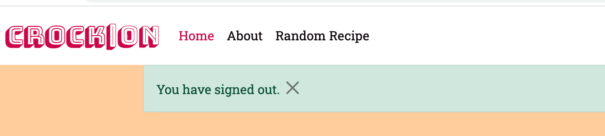
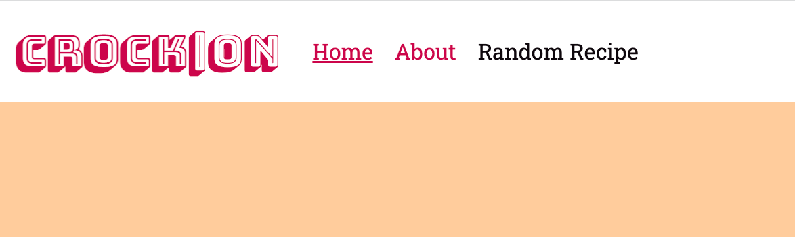
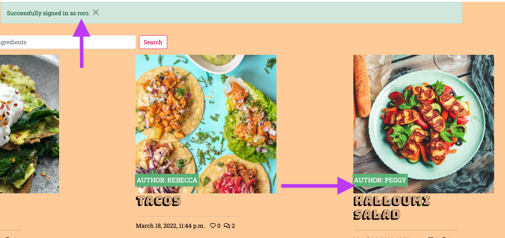

# Crock-on Recipe Bog

## Introduction

Crock-on is a recipe sharing blog website. It aims to provide users with easy recipe ideas that their fellow amateur cooks have shared. It aims to be accessible to every level of cook, and also to serve as a place where people can share their own recipes and interact with other cook's recipes without having to go through the motions of setting up their own cookery blog. 

## User Experience (UX)

### Project Goals

* To create a recipe blog for users to (i) browse other user recipes for recipe ideas and inspiration, and (ii) create a blog that amateur cooks can sign up to to share their recipes with the blog community and engage with other community members' posts.

### User Goals

* To get recipe ideas, share their recipe ideas and engage with a like-minded community of food enthusiasts.

### Site Owner's Goals

* To create a site for amateur cooks and foodies to share recipe ideas and inspiration. 

### Target Audience

* Cooks who want to share their recipe ideas without having to commit to their own personal cookery blog, and anyone looking for recipe ideas that are accessible as they have been created by other amateur cooks.

### User Stories

* First Time Visitor Goals

  * As a First Time Visitor, I want to easily understand the main purpose of the site.
  * As a First Time Visitor, I want to be able to easily navigate throughout the site to find content.
  * As a First Time Visitor, I want to easily find basic information about the blog and its purpose.
 
* Returning Visitor Goals

  * As a Returning Visitor, I want to easily access recipes and share content.
  * As a Returning Visitor, I also want to locate the business's social media links to...
  
* Frequent User Goals

  * As a Frequent User, I want to be able to access the site easily from any device, even if I am on the go.

* Site Owner Goals

  * As a site owner, I want to create an attractive and well-designed site that elicits a positive emotional response in users so that they remain on and navigate througout the site to achieve their goals.
  * As a site owner, I want maintain a safe and secure site where only registered users can share content and comment on other's posts, and where all posts are monitored for quality, and comments for inappropriate content.
  *  As a site owner, I want to have clear social media links displayed on the site which may lead to an increased following on channels to help with my blog's visibility.

More specific user stories are discussed in the context of website features in the Features section below.

### Structure:

The site has 4 pages: 

 * Home page

 * About page

 * Random recipe generator page

 * Share recipe page

 * Log in/out and register pages

For consistency of user experience, the site logo, navigation links and footer remain consitent throughout the site.

### Wireframes:

Mock-ups were made using Balsamiq to help plan and visualise the site design. They were created for 3 main screen sizes: mobile, tablet and desktop.

- [Wireframes](link): 'Home' page.

### Design:

* Colour Scheme:

  The colour palette includes fun and complimenting colours. The palette was chosen using the [Coolors](https://coolors.co/) colour generator website.

  

  The colours mainly used were:

  White was also used in different parts of the site to achieve the best possible contrast for user experience.

* Typography:

  'Bungee Shade and Roboto Slab', taken from Google Fonts, are the main fonts used throughout the website with 'Sans Serif' as the fallback font. The Bungee Shade font is eye-catching and fun, and this is used for the blog logo and recipe titles. The Roboto Slab is clean, neat and more approriate for the smaller text used throughout the site.

* Imagery:

  All images were sourced from [Unsplash](https://unsplash.com/).

  The selection of recipe images were chosen to convey variety and colour, to make the recipes appear appetising. When users upload their own recipes they also have the possiblity of adding their own images. If any images are poor quality the website admin can contact the user and provide alternative suggestions if necessary to preserve the quality of the recipe listing UI.

------

## Features

### Existing Features:

Feature 1. Navigation bar

  * Navigation bar is always at the top of the page so users know what to expect and can navigate easily.

  * A border appears at the bottom of the menu links when they are hovered over for responsiveness.

  * On mobile, the navigation menu links are within a collapsed drop down menu instead of in-line.

User stories relating to Navigation bar and footer:

  * 1.1 As a user the navigation bar is displayed with a logo on all pages with a search box on a desktop, tablet and mobile.
  * 1.2 As a user not logged in, I see a Register/Login link in the nav bar. Clicking this leads me to the appropriate registration or sign in pages and enable me to register and sign in,
  * 1.3 As a logged in user, I am notified when I am logged in and I see a logout link in the nav which enables me to click sign out which logs me out.
  * 1.4 As a user I can view the Home link in the header, as well as the website logo, and clicking both will bring me to the homepage.
  * 1.5 As a user I can click the ‘Share Recipe’ nav link which brings me to the recipe posting page where I am able to create a post.
  * 1.6 As a user I can click the ‘Random Recipe’ link which takes me to the page where a new random recipe is displayed each time I visit it.
  * 1.7 As a user if I encounter an error on the site, I will be navigated to the applicable 400, 403, 404 or 500 error page
  
  Desktop:

  

  Mobile:

  

Feature 2. Home page which contains the recipe list.

  * The recipe list is neat and well-proportioned. Each post clearly states the title, author name and no. of likes and comments received.
  * The recipe of the day can be found underneath the main recipe list, and there is a 'Recipe of the day' link included in the nav bar, so that users who are interested in this feature can quickly redirect to the bottom of the page to find and use the generator without scrolling.
  * Page is paginated.

  general pics

User stories relating to home page.

  * 2.1 As a user, I want to see a list of recipes with visually appealing images, listing clear titles and the post authors. 
  * 2.2 As a returning user, I want to see the newest recipes displayed in date order with the most recent postings first on the page:
  * 2.3 As a user, I want to see the number of comments and number of likes displayed on each recipe card on the post detail page, so that I have an idea of the popularity and engagement of a post when deciding which ones to look at.  
  * 2.4 As a user and post author, I want to be able to edit or delete a recipe post for which I am the author. 
  * 2.5 As a user if there are more than six recipes on the page, the page is paginated with six recipes per page.

Feature 3. Recipe post detail page

  * This contains a header with the post title, author name and date of posting. Links to edit and delete the post will also appear here if it is the post author logged in. 
  * Below this is the main image of the recipe and below this is the recipe post itself, which is in the format of an ingrdients list and method. Most users post in this format, however if not, a website admin will re-format the instructions if needed when reviewing the post for quality after it is posted as a draft.
  * Below the reecipe are user comments and the comment box will also appear here for authenticated logged in users. When a valid user submits a valid comment form, they receive a notification that their comment is awaiting approval. Once this is approved by admin the comment will appear under the post.
  * There is also a number of comments and number of likes displayed on the post detail page. 

  general pics

User stories relating to recipe post detail page:

  * 3.1 I want to be able to edit or delete a recipe post for which I am the author.
  * 3.2 As a user, I want to be able to comment on a recipe post
  * 3.3 As a user, I want to be able to like and unlike a recipe post.
  * 3.4 As a user who has not registered or logged into the website, I cannot add a comment to a recipe post.
  
Feature 4. Random Recipe page

  * The random recipe page is a page which generates a new random recipe each time the user visits it. It contains the recipe card as displayed on the home page, containing the recipe image, title, author name, number of likes and comments and posting date.

User stories relating to recipe Random Recipe page:

  * 4.1 As a user, I want quick and easy inspiration for cooking ideas without browsing through a large number of recipes.

  Desktop:

  

  Mobile: 

  

Feature 5. About page

  * This seciton provides a brief background of the blog, its purpose and a welcoming message for website users.
  
  Desktop:

  

  Mobile:

  

Feature 6. Footer

  * Footer is conventionally placed at the bottom of the site and consistently displayed on all pages.

  * It includes centered social media links which open in new tabs. 

  * The aim is for a clean and minimalist look for the footer.

  Desktop: 

  

  Mobile:

  
  
  User stories relating to the footer:

  * 6.1 As a user, I can access the blog site's social media pages which open in new tabs so that I can stay updated on blog news and updates.

Feature 7. Share Recipe page

  * This is minimal, with the form located in the centre of the page.
  * The recipe posting form has the option for the user to attach their own recipe image, along with a title, unique slug and recipe content.

  Desktop:

  

  Mobile:

  

Feature 8. Register/Log in and Log out pages:

  * These three pages have a similar layout. The function is in the centre of the page.
  * There is user validation when filling out the forms and upon signing out the user is asked if they are sure they would like to do so.

  Desktop:

  
  
  

  Mobile:

  
  
  

 User stories relating to Register/Log in and Log out pages:

  * 

Feature 9. Admin

  * These three pages have a similar layout. The function is in the centre of the page.
....

User stories relating to Admin:

  * These three pages have a similar layout. The function is in the centre of the page.

### Features To be Implemented in Future:

* Recipe list page: 
* Recipe detail page: Rating feature
* Tag posts with categories e.g. vegetarian vegan so user can search by these terms.
* Paginate comments

## Technologies Used

### Languages:

*  [HTML 5](https://en.wikipedia.org/wiki/HTML5)
*  [CSS 3](https://en.wikipedia.org/wiki/CSS)
*  [Javascript](https://www.javascript.com/)
*  [Django]((https://www.djangoproject.com/)
*  [Python](https://www.python.org/)

Python was used for the project's server side coding, in addition to a number of libraries. This is the list as per the requirements.txt file:
asgiref==3.5.0
dj-database-url==0.5.0 (Support for DATABASE_URL environment variable)
cloudinary==1.28.1
dj3-cloudinary-storage==0.0.6
Django==3.2 (Web framework)
django-allauth==0.48.0 (Web framework authentication)
django-crispy-forms==1.14.0 (Django rendering of forms)
django-summernote==0.8.20.0
django-autoslug==1.9.8
gunicorn==20.1.0 (Python WSGI Http server)
oauthlib==3.2.0 (Framework for oauth1 and oauth2)
psycopg2==2.9.3
PyJWT==2.3.0
python3-openid==3.2.0 (Support for the OpenID decentralized identity system)
pytz==2021.3
requests-oauthlib==1.3.1 (Authentication support for Requests)
sqlparse==0.4.2 (Non-validating SQL parser for Python)

### Frameworks, libraries and programs used:

* [Balsamiq](https://balsamiq.com/) - to create wireframes for the site as part of the project preparation.
* [Google Fonts](https://fonts.google.com/) - to import the 'Kaisei HarunoUmi' and 'Sans Serif' fonts into the HTML file, which were then used throughout the site.
* [Font Awesome](https://fontawesome.com/) - for icons which were added to some headings throughout the site for aesthetics.
* [Coolors](https://coolors.co/) - for an appropriate and attractive colour palette.
* [Tinypng](https://tinypng.com/) - to resize images.
* [Chrome DevTools](https://developer.chrome.com/docs/devtools/) - to inspect and debug the code through all stages of the development.
* [Lighthouse](https://developers.google.com/web/tools/lighthouse) - to check the site for performance, accessibility and best practices.
* [Am I Responsive](http://ami.responsivedesign.is/) - to produce a preview of the site on different devices.
* [W3C HTML Validator](https://validator.w3.org/#validate_by_input) - to validate HTML code.
* [W3C CSS Validator](https://jigsaw.w3.org/css-validator/) - to validate CSS code.
* [GitHub](https://github.com/) - for hosting the project code and version control.
* [Gitpod](https://gitpod.io/account) - to write the code and push it to GitHub.
* [Github Pages](https://pages.github.com/) - to deploy the site.
* [Unsplash](https://unsplash.com/) - for images.
* [Bootstrap]
* [Postgres]
* [SQL lite]

# Deployment

## Deploying to GitHub Pages

The site was developed in GitPod and ...

* Navigate to the Github repository...

# Testing

I tested the site regularly during the development process, by previewing it in the live server window and inspecting with Google Chrome DevTools at various stages.

When I was editing for responsiveness I tested the site on several different devices.

At the final stages of the project the W3C Markup Validator,W3C CSS Validator Services, along with PEP8 and JSHint were used to validate every page of the project to ensure there were no syntax errors.

## Testing User Stories 

General:

* First time visitor goals:

  * As a First Time Visitor, ...

    Test result: Pass

    Explanation...

    

* Returning Visitor Goals

  * As a Returning Visitor, I want to ...

    Test result: Pass

    Explanation

    

  * As a Returning Visitor, I want ...

    Test result: Pass

    Explanation

    

* Frequent User Goals

  * As a Frequent User, I want to ...

    Test result: Pass.

    Explanation...

    

* Site Owner Goals

  * As a site owner, I want ...

    Test result: Pass.

    Explanation

Feature User Story testing:

1. Navigation bar and footer:

  * 1.1 As a user the navigation bar is displayed with a logo on all pages with a search box on a desktop and mobile.

    

    

    Result: Pass

  * 1.2 As a user not logged in, I see a Register/Login link in the nav bar. Clicking this leads me to the appropriate registration or sign in pages and enable me to register and sign in.
    
    (i)
    (ii)-(a)
    (ii)-(b)
    (iii)

    Result: Pass 

  * 1.3 As a logged in user, I am notified when I am logged in and I see a logout link in the nav which enables me to click sign out which logs me out.

    (i)
    (ii)
    (iii)

    Result: Pass

  * 1.4 As a user I can view the Home link in the nav bar, as well as the website logo, and clicking both will bring me to the homepage.

    (i)
    (ii)

    Result: Pass

  * 1.5 As a user I can click the ‘Share Recipe’ nav link which brings me to the recipe posting page where I am able to create a post.

    (i)
    (ii)
    (iii)

    Result: Pass

  * 1.6 As a user I can click the ‘Random Recipe’ link which takes me to the page where a new random recipe is displayed each time I visit it.

   (i)
   (ii)

   Result: Pass

  * 1.7 As a user if I encounter an error on the site, I will be navigated to the applicable 400, 403, 404 or 500 error page
  
        To do

   Result: Pass

2. Home page which contains the recipe list.

  * 2.1 As a user, I want to see a list of recipes with visually appealing images, listing clear titles and the post authors. 

    

    Result: Pass

  * 2.2 As a returning user, I want to see the newest recipes displayed in date order with the most recent postings first on the page:

    

    Result: Pass

  * 2.3 As a user, I want to see the number of comments and number of likes displayed on each recipe card on the post detail page, so that I have an idea of the popularity and engagement of a post when deciding which ones to look at.  

    

    Result: Pass

  * 2.4 As a user and post author, I want to be able to edit or delete a recipe post for which I am the author. 

    (i)
    (ii)

    Result: Pass
  
  * 2.5 As a user if there are more than six recipes on the page, the page is paginated with six recipes per page.

    

    Result: Pass

3. Recipe post detail page.

  * 3.1 I want to be able to edit or delete a recipe post for which I am the author.

    (i)
    (ii)

    Result: Pass

  * 3.2 As a user, I want to be able to comment on a recipe post

    (i)
    (ii)

    Result: Pass

  * 3.3 As a user, I want to be able to like and unlike a recipe post.

    (i)

    Result: Pass

  * 3.4 As a user who has not registered or logged into the website, I cannot add a comment to a recipe post.

    (i)
    (ii)

4. Random Recipe page

  * 4.1 As a user, I want quick and easy inspiration for cooking ideas without browsing through a large number of recipes.

    (i)
    (ii)

    Result: Pass

## Validator Testing

* HTML Validator Errors & Warnings:

  * Warning/Error:...

    Fix: ...

* CSS Validator Errors & Warnings

  * Error:

  * Fix: 

I re-ran the deployed site through both the HTML and CSS validators and no warnings or error were found:

## Lighthouse Testing

The Lighthouse report from Google Chrome DevTools showed very good results for Performance, Accessibility, SEO and best practices of the site. 

Home page: 

## Further Testing

* Devices and browsers :

  * The Website was tested on multiple browsers - Google Chrome, Safari, Microsoft Edge and Firefox browsers.
  * The website was viewed on all devices available to me - Desktop, Laptop, iPhone6, Huawei Y6 and Oppo Find X2 Lite.

* Site Features:

  * The nav bar remains and the top of the page and the menu items adapt to remain within the nav bar on all devices.
  * The font is legible on all device sizes.
  * Images are resized where needed and never stretched or distorted on smaller devices.
  * All buttons and links direct to the correct parts of the site.

## Bugs

* Fixed:
  * ...
  
* Known:
  * ...

# Credits

## Code

The Code Institute LMS content, including the Django blog walthrough project, as well as some posts on Stackoverflow were used to create this site. All code taken from these resources has been adapted to suit the needs of this site, except for the specific cases referenced below.

This [Stack Overflow](https://stackoverflow.com/questions/26744659/center-an-button-with-respect-to-an-image-css) article was used to ...

Icons taken from [Font Awesome](https://fontawesome.com/).

## Images

Images were sourced from Unsplash:

Image by .... on [Unsplash](https://unsplash.com/photos/NqeB4q6KOFg)

# Acknowledgements

Thank you to:

* My mentor, Victor Miclovich, for his help and guidance.
* The tutors at the Code Institute and the CI Slack community for their help and support.

------